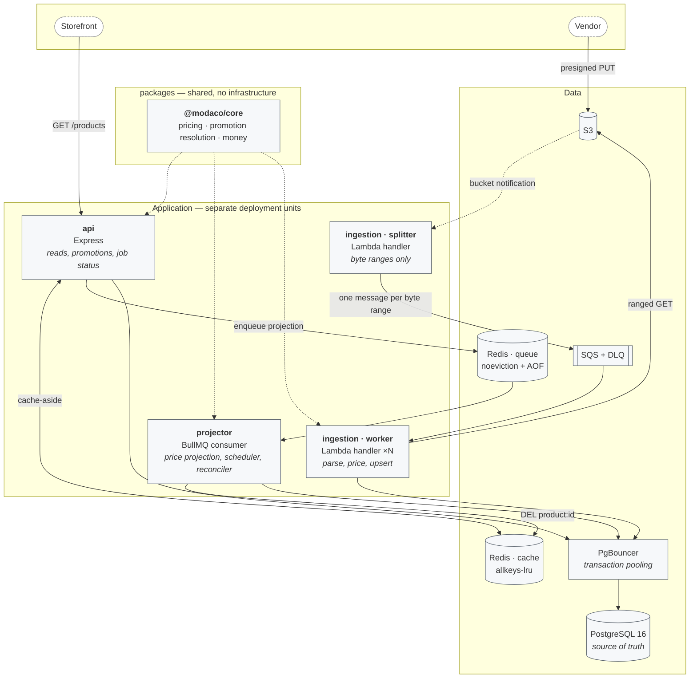
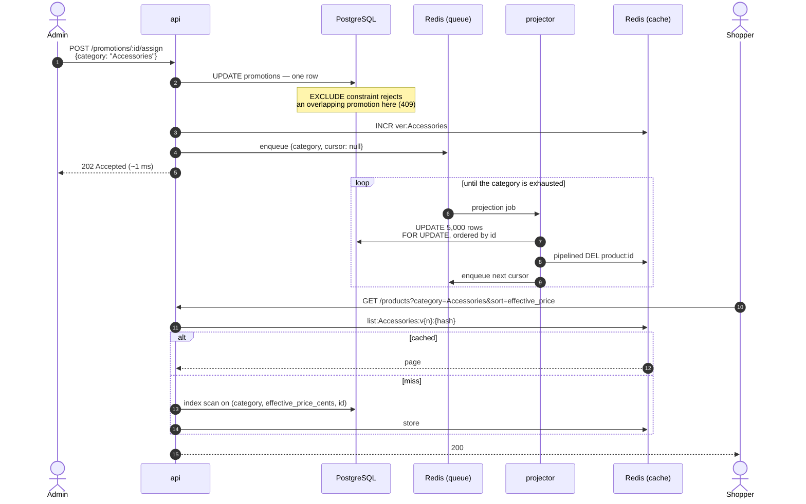
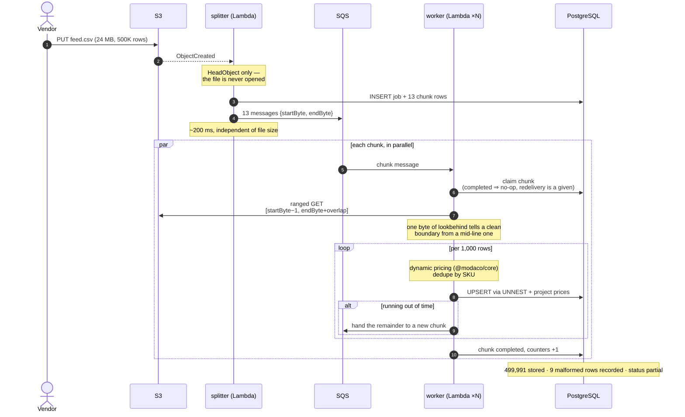
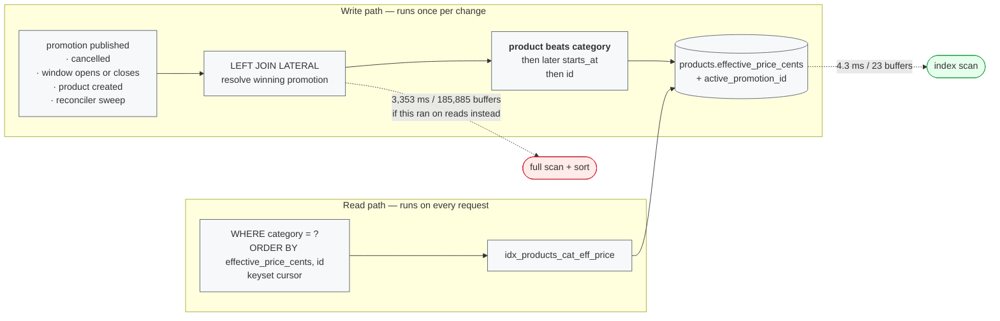

# Architecture

Four diagrams: what runs, how a flash sale propagates, how a 500K-row file is ingested,
and where an effective price comes from.

For *why* any of it is shaped this way, see [ADR.md](../ADR.md).

---

## What runs

Three things this picture is making a point about:

**`@modaco/core` is reached by dotted lines** because it is a library, not a service. The
case requires every ingested record to pass the same pricing rules the API applies. One
implementation, three runtimes.

**Everything reaches PostgreSQL through PgBouncer.** Six ingestion workers with a generous
pool each would exhaust `max_connections` and take the API down with them. Measured with
six workers running: three backend connections.

**The two Redis instances are not redundancy.** A cache should evict its coldest entry
under memory pressure; a queue must not. The policy is per instance, so one instance means
choosing which of them is allowed to be wrong.

---

## Scenario B — a flash sale on 50,000 products

The write returns after one row. The fifty thousand updates that follow are queued,
applied in bounded batches, and never block a reader. Invalidation is one `INCR`: every
cached listing for that category becomes unreachable at once, whatever combination of
filters and cursors produced it.

Publishing answers `202`, not `200`. The promotion is durable and authoritative
immediately; the prices it implies are still rolling through. `200` would promise a
consistency this endpoint deliberately does not provide.

---

## Scenario A — 500,000 rows under a serverless timeout

The splitter is the whole trick. It asks S3 for the object's size, divides that number
into byte ranges, and enqueues one message each — so no file is large enough to make it
time out, because no file is ever read.

Splitting by offset lands boundaries mid-line. A worker owns every line that *starts*
inside its range, skips the partial line at the front, and reads slightly past its end to
finish the last line it owns. The single byte of lookbehind distinguishes a boundary that
landed cleanly on a line start from one that landed mid-line; without it, every clean
boundary silently loses a row.

---

## Where an effective price comes from

Sorting by a derived value has two implementations: scan everything on every read, or
materialize once per change and index it. The `LATERAL` join still exists — it moved to
the write path, where it runs once per promotion change instead of once per request.

The 775× difference is measured, on 83,331 products in one category, for a single page of
twenty. The reason it is that large: to know which twenty products are cheapest, the
database must compute all 83,331 effective prices first. `LIMIT 20` saves nothing.
